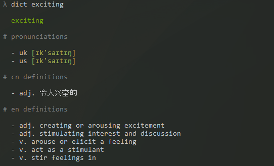

# dict-en-zh

An English-Chinese dictionary, both cli and a node module.



### Install

```
npm install dict-en-zh
```

### CLI

```
dict <word> [options]
```

to get help information, use `dict -h` or `dict --help`.

### Module

```javascript
const dict = require('dict-en-zh')

dict('echo').then(console.log).catch(console.trace)
```

### API

- `dict(word[, source='shanbay'])` , which is identical to `dict[source](word)`
- `dict.shanbay(word)`
- `dict.youdao(word)`

### License

MIT
